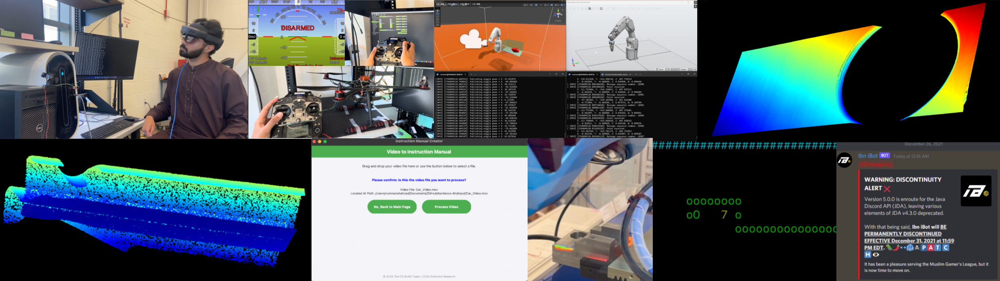

  <h1>Rumman Shahzad</h1>
  
<strong>Software Engineer | Applied R&D, Robotics, AI/ML, and Full-Stack</strong>

  
<strong><a href="https://linkedin.com/in/rumman-shahzad">LinkedIn</a></strong> | <strong><a href="mailto:rshahzad@proton.me">Email</a></strong>

  <em>I build software at the intersection of robotics, AI, full-stack development, and computer vision. I also do research and technical writing, including papers, conference posters, reports, and proposals for projects and grant funding.</em>

 

## MS Thesis Project
My MS thesis explores AI-assisted inspection of culverts and concrete infrastructure using drones, mixed reality, wireless teleoperation and control, and computer vision with locally hosted AI models such as DINOv3 and YOLO.
* **[Ground Station Repository](https://github.com/rshaz2713/Drone-Inspection-Ground-Station)** - Python ground-station software for wireless gimbal teleoperation, drone video reception, networking, and AI-assisted analysis. Acts as middleware between HoloLens and the drone.
* **[HoloLens Unity Repository](https://github.com/rshaz2713/Drone-Inspection-Unity)** - Unity/MRTK3 mixed-reality interface for the HoloLens FOV, as well as communication between the HoloLens and ground station for gimbal teleoperation and camera feed transmission.
* **[Thesis Proposal](https://drive.google.com/file/d/19Rk60HqRzOT6fECXwwJruvHoOz7zj6iP/view?usp=sharing)** - A proposal drafted outlining the purpose, methodologies, and steps that will be taken to accomplish completion of the project.
* **[Progress Photos and Videos](https://drive.google.com/drive/folders/1AH60JXa73fyvs4VgyJuPsQylC9yghYjL?usp=sharing)** - Photos, demonstrations, and development footage documenting the project's progress from prototyping through integration.
* **_Thesis paper will be added upon completion._**

## CCSU Robotics Lab Work
These repositories highlight projects I contributed to as a developer in the CCSU Robotics Lab.
* **[LLM Automatic Documentation](https://github.com/rshaz2713/LLM-Automatic-Documentation)** - Python video-to-documentation pipeline using FFmpeg, Whisper, keyframe extraction, and LLM processing. I contributed as a developer from September to December 2024, integrating pipeline stages and data flow, with my commits in the `main` branch. The project has continued evolving with later Robotics Lab teams.
* **[3D Scanning and Inspection](https://github.com/rshaz2713/3D-Scanning-and-Inspection)** - C# robotic inspection system integrating ABB RobotStudio and FocalSpec SDKs for automated 3D scanning of manufacturing parts. I contributed from January to May 2025 as part of my senior capstone in the `main` branch, originally focused on GKN Aerospace airfoil blades. I later extended the codebase for NIMS Mill 2.5 Step Block data acquisition with Virginia Tech, found in the `vt-data-acquisition` branch.

## CCSU Coursework Projects
Selected software projects from my undergraduate and graduate coursework:
* **[CampusBridge](https://github.com/rshaz2713/CampusBridge)** - A Django prototype for university course enrollment, grade entry, and degree-audit workflows, developed in a Scrum team of four. _CS 530 (Advanced Software Engineering), Spring 2026_
* **[Ticketmaster API](https://github.com/rshaz2713/CS416TicketmasterAPI)** - Django web application integrating the Ticketmaster REST API, authentication, favorites, and database persistence through Django ORM. _CS 416 (Web Programming), Fall 2025_
* **[C Snake Game](https://github.com/rshaz2713/CCSU-CS355-SnakeCourseProject)** - Terminal-based Snake game written in C with ncurses, including regular and hard game modes. Developed with a classmate. _CS 355 (Systems Programming), Spring 2024_

## Research and Technical Writing
Beyond coding and my thesis writing, I also do research in robotics, software engineering, and security. I write project proposals, draft grant funding proposals, create and edit papers, and make conference posters for presentations. Some of this also includes reports I've written from coursework.

* **[ROS 1 Telerobotics Security Research](https://drive.google.com/file/d/1tKtFylsWMxeAg5Qldnm9QPWrjVd6HCCq/view?usp=drive_link)** - Evaluated a student-developed VR telerobotics system developed with ROS 1 (Robot Operating System) by demonstrating a node-injection attack and proposing an authentication-based mitigation. _Presented at the AAAS S-STEM REC Scholars Meeting 2025 in San Diego, CA._
* **[Supervisory Software-Based Robotic 3D Scanning Research](https://drive.google.com/file/d/1FMW1nSTQMzkbFbo3mp7XRh6nsKWqjCeO/view?usp=sharing)** - A poster inspired by the airfoil scanning project and Virginia Tech data acquisition spin-off (see above), explaining the idea of a software-based supervisory architecture for using industrial hardware for real applications. _Presented at the 2026 University Research and Creative Achievement Day (URCAD) at CCSU._
* **[NASA CTSGC 2025 Grant Proposal and Poster](https://drive.google.com/drive/folders/1QdpfJtu7R4pSC5sHtLbxpkLCJNewO_-P?usp=sharing)** -  Grant proposal that secured $12,000 in NASA CT Space Grant funding to support summer robotics research for myself and a community college student, along with the resulting research poster. _Presented at the 2025 NASA CT Space Grant Expo at the New England Air Museum, East Granby, CT._
* **[CCSU Robotics Lab Project Proposal Samples](https://drive.google.com/drive/folders/1eZ3Kb382oBZC6HHzTEumxXH8fKEidzyY?usp=sharing)** - These are some samples of proposals I have written for establishing project partnerships and direction for student development, where I mentored teams as Product Owner. These include projects I previously worked on as a developer, greenfield projects I established in the lab, and projects supporting R&D initiatives for robotics and AI.
* **[Agent Tesla Malware Analysis](https://drive.google.com/file/d/1Ca1s0_ZkJ08VHfMdWJqaxJVxOvpmYZ09/view?usp=drive_link)** - Malware analysis report of a real Agent Tesla trojan, covering static and dynamic analysis, unpacking attempts, runtime behavior, network analysis, and 10 MITRE ATT&CK mappings. Used tools such as Ghidra, Wireshark, pe-sieve, Process Explorer, Process Monitor, FakeNet, and dnSpy. _CS 511 (Advanced Software Reverse Engineering), Spring 2026_
* **[Software Testing & QA Project Report](https://drive.google.com/file/d/1I4Hkyv-1AtUMdZFnRJe2imaf-d7LYxht/view?usp=drive_link)** - Graduate testing project applying base-choice, prime-path, restricted active-clause, and mutation coverage criteria to the Apache Commons Math Java codebase, including JUnit test design and analysis of infeasible test requirements. _CS 506 (Software Testing and Quality Assurance), Spring 2025_

## CAE in Cybersecurity Community Internship
I interned for the CAE in Cybersecurity Community via Augusta University from January to March 2025. I worked on integration of multithreaded Ollama LLM calls to replace Gemini API for generating questions from articles for a cybersecurity training platform.  

* ~~[CAE Internship Codebase](https://github.com/rshaz2713/CAE-Internship-VIVID_cohort6)~~ - **This fork is private, with repository access limited to users authorized by the original owner.**

## Early Independent Project
* **[Ibn iBot](https://github.com/rshaz2713/Ibn-iBot)** - My first substantial software project, built in high school with AP Computer Science A as my only prior programming coursework. Developed with Java and the Java Discord API, Ibn iBot ran 24/7 as an automoderator for the 4,000+ member Muslim Gamers' League Discord community, providing automated safety checks and staff moderation tools. _Built and maintained October 2020 to December 2021._
