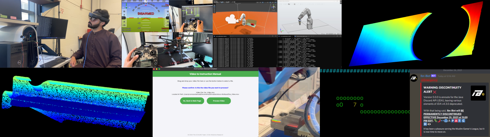

  <h1>Rumman Shahzad, PSM I, PSPO I</h1>
  
<strong>Software Engineer | Applied R&D, Robotics, AI/ML, and Full-Stack</strong>

  
<strong><a href="https://drive.google.com/drive/folders/1qLdb0isP8OpDw6XOewBv7Rw801-QDJFQ?usp=sharing">My Technical Writing</a></strong> | <strong><a href="https://linkedin.com/in/rumman-shahzad">LinkedIn</a></strong> | <strong><a href="mailto:rshahzad@proton.me">Email</a></strong>

  <em>I build software at the intersection of robotics, AI, full-stack development, and computer vision. I also do research and technical writing, including papers, conference posters, course project reports, and proposals for projects and grant funding.</em>

 

<h3><em><strong>Some of my favorite projects...</strong></em></h3>

| Project | Description | Notes |
| --- | --- | --- |
| **AI-Assisted Mixed Reality UAV Civil Inspection**   - [Ground Station Repo](https://github.com/CCSU-Robotics-Research/Drone-Inspection-Ground-Station)   - [Unity Repo](https://github.com/CCSU-Robotics-Research/Drone-Inspection-Unity) | Inspecting defects in culverts using **drones**, **Microsoft HoloLens**, wireless teleoperation and control, and **computer vision** with locally hosted AI models to aid civil engineers. | - [Media Gallery](https://drive.google.com/drive/folders/1AH60JXa73fyvs4VgyJuPsQylC9yghYjL?usp=share_link)   - [Thesis Proposal](https://drive.google.com/file/d/19Rk60HqRzOT6fECXwwJruvHoOz7zj6iP/view?usp=share_link) |
| **[LLM Automatic Documentation](https://github.com/CCSU-Robotics-Research/techdocs-llm)** | Python video-to-documentation tool using **FFmpeg**, **Whisper**, keyframe extraction, and LLM processing. I integrated **pipeline** stages and data flow in Fall 2024 semester. | - [GUI Example Window](https://drive.google.com/file/d/1aVOcEFlriGLJS7lTTQKnz_LZH5etZYGm/view?usp=sharing)   - [Sample Docs Image](https://drive.google.com/file/d/1UtE0R6g3OJAm44mt0Nvxr-Ystk8M7wyR/view?usp=sharing) |
| **[3D Scanning and Inspection](https://github.com/CCSU-Robotics-Research/FocalSpec-Airfoil-Scanner)** | **C# robotic inspection system** for automated 3D scanning of manufacturing parts. Scanned airfoil blades for GKN Aerospace and NIMS Mill 2.5 Step Blocks for ML research with Virignia Tech. | - [Scanning GUI](https://drive.google.com/file/d/1mKotkT5u1Do1DAtTrBl6Mu-zcVxlAfn2/view?usp=sharing)   - [Sample Scans](https://drive.google.com/drive/folders/1F-md4ljy4L34cTSlxGq9juBiIZKdpFLC?usp=sharing)   - [Sample Scanned Parts](https://drive.google.com/drive/folders/1amCGV7oW-fsOl8WOLKev_FaXTbeaOWNI?usp=sharing) |
| **[Ibn iBot](https://github.com/rshaz2713/Ibn-iBot)** | Automoderator Discord bot with Java Discord API v4, serving a **global Discord community of 4,000+ members**. Provided automated safety checks, staff moderation tools, and blocking links from malicious actors. | My first software project with substantial impact.   [Farewell Message](https://drive.google.com/file/d/1918YJ2SjGwORDXw0qf_riiHIlZ4KnEW6/view?usp=sharing) |

<h3><em><strong>Some of my technical writing (posters, papers, proposals, reports)...</strong></em></h3>

| Writing | Description | Venue |
| --- | --- | --- |
| **[ROS 1 Telerobotics Security Research](https://drive.google.com/file/d/1uXu6xS11aNMld5OPz_nhY1He9qO_WI5G/view?usp=sharing)** | Evaluated a VR telerobotics system developed with ROS 1 (Robot Operating System) by demonstrating a node-injection attack and proposing an authentication-based mitigation. | AAAS S-STEM REC Scholars Meeting 2025, San Diego, CA |
| **[Supervisory Software-Based Robotic 3D Scanning Research](https://drive.google.com/file/d/1FMW1nSTQMzkbFbo3mp7XRh6nsKWqjCeO/view?usp=sharing)** | Research inspired by the airfoil scanning project (see above), explaining the idea of a software-based supervisory architecture for using industrial hardware for real applications. | CCSU University Research and Creative Achievement Day 2026 |
| **NASA CTSGC 2025 Grant [Proposal](https://drive.google.com/file/d/1BtvtuX7DGEs_3Eva-pr2FFakG-e-UCQm/view?usp=sharing) and [Poster](https://drive.google.com/file/d/1TPWJiQXoStzN00HSFIWgJ0sfCWHshWzz/view?usp=share_link)** | Secured $12,000 in NASA CT Space Grant funding to support summer robotics research in 3D airfoil point cloud modeling with robotics and software engineering. | 2025 NASA CT Space Grant Expo @ New England Air Museum, East Granby, CT |
| **[CCSU Robotics Lab Project Proposal Samples](https://drive.google.com/drive/folders/1eZ3Kb382oBZC6HHzTEumxXH8fKEidzyY?usp=sharing)** | 6 of various proposals I have written for establishing project partnerships and direction for student development, where I mentored teams as Product Owner. Includes projects I once worked on as a developer, greenfield projects I established from the ground up, and other software projects supporting robotics and AI R&D. | --- |
| **[Agent Tesla Malware Analysis](https://drive.google.com/file/d/1Ca1s0_ZkJ08VHfMdWJqaxJVxOvpmYZ09/view?usp=sharing)** | Malware analysis report of a real Agent Tesla trojan, covering static and dynamic analysis, unpacking attempts, runtime behavior, network analysis, and 10 MITRE ATT&CK mappings. Used tools such as Ghidra, Wireshark, pe-sieve, Process Explorer, Process Monitor, FakeNet, and dnSpy. | CS 511 (Advanced Software Engineering), Spring 2026 |
| **[Software Testing & QA Project Report](https://drive.google.com/file/d/1I4Hkyv-1AtUMdZFnRJe2imaf-d7LYxht/view?usp=sharing)** | Graduate testing project applying base-choice, prime-path, restricted active-clause, and mutation coverage criteria to the Apache Commons Math Java codebase, including JUnit test design and analysis of infeasible test requirements. | CS 506 (Software Testing and Quality Assurance), Spring 2025 |

  <h2>Let's connect via <strong><a href="https://linkedin.com/in/rumman-shahzad">LinkedIn</a></strong> or <strong><a href="mailto:rshahzad@proton.me">email</a></strong>!</h2>

